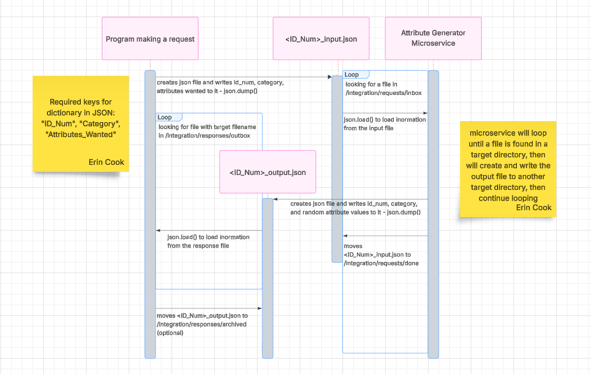

# Cs-361_AttributeGenerator
Generates random attributes of fantasy races for the user.

## What kinds of races? What kinds of attributes?
The possible creatures you can generate attributes for are:
- Dwarf
- Elf
- Gnome
- Halfling
- Halforc
- Pokemon

Any of the first five creature Categories can have the following attributes generated:
- height
- weight
- eye color
- hair color

Pokemon can have the following attributes generated:
- type1
- type2
- legendary

## Microservice Directory Structure
### /integration/requests/inbox:
Incoming request files should be placed here

### /integration/requests/done:
Requests that have been processed get placed here by the microservice

### /integration/requests/error:
This functionality is currently not implemented, but this folder would hold input files that created errors upon attempted processing.

### /integration/responses/outbox:
JSON files with the randomly generated attributes (the output of the microservice) are placed here by the microservice.

### /integration/responses/archived:
The caller of the microservice can use this folder to hold microservice output files that it has already dealt with, if desired.

### /resources/attributes:
The master attributes JSON file is kept here.

## How it works - here's what you need to know!
- The microservice is set up so that SIGINT and SIGTERM signals sent to the microservice will cause the microservice to shut down after completing its current attribute generation, if applicable.
- Once started, the microservice will check the 'inbox' folder every 5 seconds for an inbound request.
- If at least one is found, it will process one and then return to looking for additional ones every 5 seconds.
- If more than one inbound request file is found, it will process the least recently modified request (goal is a FIFO system, roughly).

## Format of input file (JSON)
Filename: <ID_Num>_input.json  
  
{  
    &emsp;"ID_Num": "(same ID_Num as in the filename)"  
    &emsp;"Category": "(creature-type you want random attributes for)"  
    &emsp;"Attributes_Wanted": [list of attributes wanted]  
 }  

 Example:  dwarf_20260221223103_input.json
   
 {  
    &emsp;"ID_Num": "dwarf_20260221223103"  
    &emsp;"Category": "Dwarf"  
    &emsp;"Attributes_Wanted": [  
      &emsp;&emsp;"weight",  
      &emsp;&emsp;"eye_color",  
      &emsp;&emsp;"hair_color"  
    &emsp;]  
 }  

## Format of output file (JSON)
Filename: <ID_Num>_output.json  
  
{  
    &emsp;"ID_Num": "(same ID_Num as in the filename)"  
    &emsp;"Category": "(creature-type random attributes were generated for)"  
    &emsp;"Attributes": {dictionary of attributes}  
 }  
  
 Example: dwarf_20260221223103_output.json
   
 {  
    &emsp;"ID_Num": "dwarf_20260221223103"  
    &emsp;"Category": "Dwarf"  
    &emsp;"Attributes": {  
    &emsp;&emsp;  "weight": 173,  
    &emsp;&emsp;  "eye_color": "Ruby Red",  
    &emsp;&emsp;  "hair_color": "Copper"  
    &emsp;}  
 }  

 ## How do I create the JSON request file, with the right name, in the right folder?? (aka Making A Request Of The Microservice)
 1. Create a dictionary with your request data (see above).
 2. Create a JSON file with the correct file name (see above) into /integration/requests/inbox.
 3. Write the dictionary into the JSON file you've created, using `json.dump()`.
  
 ### Example:  
 if 'output_dictionary' is the dictionary you've created with your request information (see above), create the output file and write your request into it like this:  
 `path_name = f'integration/requests/inbox/{id_num}_input.json'`  
  `with open(path_name, 'w') as out_file:`  
  &emsp;`json.dump(output_dictionary, out_file, indent=4)`  

 ## How do I find the response file and read it?? (aka Receiving Data From The Microservice)
 1. We recommend "listening" for the response; i.e. implement a loop where you sleep for a short time and then look for the desired file in the output directory.
 2. Look in the folder 'integration/responses/outbox' for a file with a filename corresponding to your request (matching ID_Num, with "_output" instead of "_input").
 3. Load the contents of the JSON into the calling program using `json.load()`. This will give you a dictionary with the response data in it.
 4. Parse the contents of the dictionary in whatever way you desire. The random attributes will be under the key `"Attributes"`.
  
 ### Example:  
 using the 'os' module in python:  
 `folder_path = 'integration/responses/outbox'`  
 `file_name = f'{id_num}_output.json'`  
 `full_path = os.path.join(folder_path, file_name)`  
 `while not os.path.exists(full_path):`  
 &emsp;`time.sleep(1)`  
   
 `with open(full_path, 'r') as response_file:`  
 &emsp;`response = json.load(response_file)`  

This will place the response data from the JSON file into a dictonary called `response`.

## UML Diagram

 
    
    

